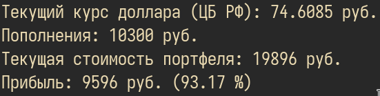

# Аналитика доходности портфеля на криптовалютной бирже EXMO
Вдохновлено [этим](https://www.youtube.com/watch?v=QJ6yRulR_HA) видео.


### Настройка
Для работы необходимо установить две переменных окружения:
```
export EXMO_PUBLIC_KEY=some-public-key
export EXMO_SECRET_KEY=some-secret-key
```
Здесь `EXMO_PUBLIC_KEY` и `EXMO_SECRET_KEY` — соответственно публичный и приватный API ключи, которые можно получить по [ссылке](https://exmo.com/en/profile#/api).
### Использование:
```
python main.py
```
### Скриншоты:

